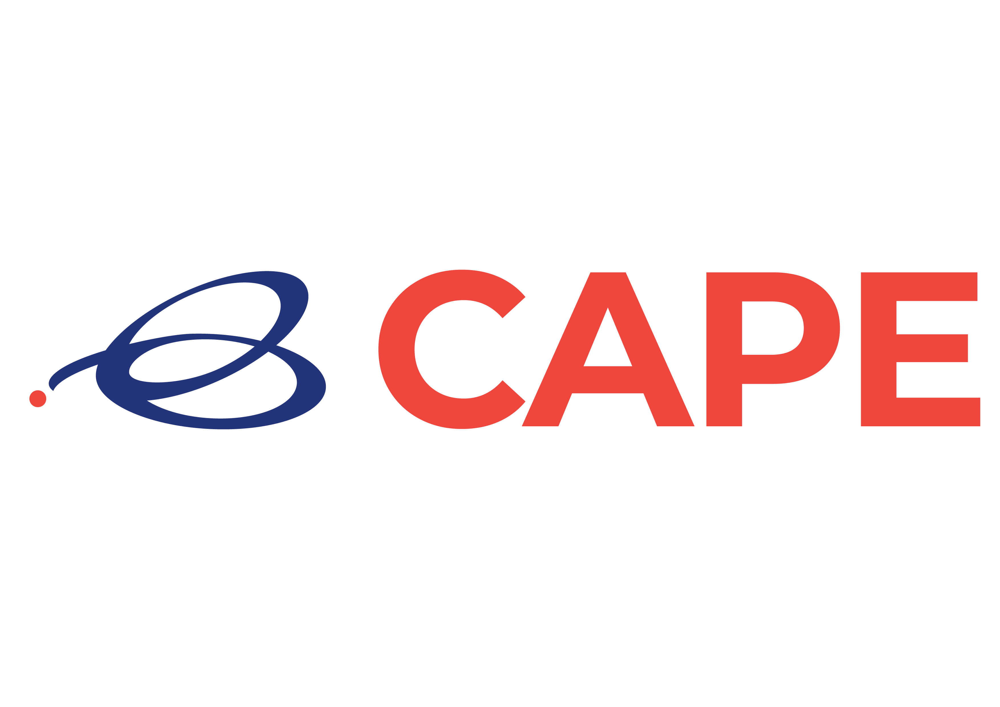

<p align="center" style="background-color:#23327c"></p>

`CAPE` is a multi-cluster application and data management tool.

## Project Status

CAPE is currently in beta phase with v1.0.0. Check out the
[Release Notes][6] for more details 


## Documentation/User Guides

All you need to get started with CAPE is available [here](https://docs.cape.sh/docs/).


## CAPE in Action

[](https://youtu.be/4KJt8NXTO8E "CAPE INTRO")


## Features

* Multi-cluster Data Management
* Multi-cluster Application Management

<hr /> 

## Installing CAPE

### Downloading a binary from GitHub Releases 

#### Start k3d local instance
Prerequisites: [docker](https://docs.docker.com/get-docker/), [k3d](https://github.com/rancher/k3d)
```sh
k3d create -n dev -p 80:80 -p 443:443 --wait=0
export KUBECONFIG="$(k3d get-kubeconfig --name='dev')"
kubectl cluster-info
````

#### Installing CAPE
> Enter the following command:
```
kubectl apply -f https://cape.sh/install/simple.yaml
```

#### Accessing CAPE UI
> Enter the following command:
```
kubectl -n cape wait --for=condition=available --timeout=600s deployment/web
#wait for completion of CAPE deployment
open http://127.0.0.1.nip.io
```
<hr />


## Kubernetes Versions Compatibility

| CAPE Version | 1.18 | 1.17 | 1.16 | 1.15 | 1.14  | Supported providers|
| --------------- | ---- | ---- | ---- | ---- | ----  | -----------------|
| v1.0.0        | +    | +    | +    | +    | -        | AWS, DigitalOcean, GCE,  |
| v1.0.0        | -    | -    | +    | +    | +        | AWS, DigitalOcean, GCE,  |


## Getting Started
Get started quickly using this [tutorial](https://docs.cape.sh/docs/simple-install)[10]


## Getting Involved

We appreciate your feedback and active participation.

If you want to get in touch with us to discuss improvements and new
features, please [create a new issue on GitHub][1] or connect with us over on our
mailing list or Slack:

* [CAPE mailing list](https://capesh.slack.com/)
* [`#general` Slack channel](https://capesh.slack.com)

## Reporting Bugs

If you encounter issues, please [create a new issue on GitHub](https://github.com/cape-sh/cape/issues/new) or talk to us
on the [`#general` Slack channel](https://capesh.slack.com). When reporting a bug please include the
following information:


[1]: https://github.com/cape-sh/cape/issues/new
[2]: https://github.com/cape-sh/cape#features
[3]: https://groups.google.com/forum/#!forum/cape-sh
[4]: http://capesh.slack.io/
[5]: https://docs.cape.sh/blog/2020/06/01/Introducing-CAPE-v0.1.1

